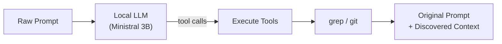

# promptscout

A CLI tool that enriches your coding agent prompts with codebase context using a local LLM. No API keys, no cloud. Runs on your machine.

**Designed as a Claude Code plugin.** It hooks into your prompt submission flow and adds codebase context before Claude sees it.

## Motivation

When you ask a coding agent like Claude Code, Cursor, or Copilot to work on your codebase, the agent spends time and tokens discovering which files matter. It greps, reads, explores, all on your dime.

promptscout does that discovery locally, for free. A small local LLM reads your prompt, searches your codebase with `grep` and `git`, and appends the results to your original prompt. The paid agent gets a prompt that already contains the relevant file paths, code snippets, and commit history. It can skip straight to the actual work.

Your original prompt is never modified. promptscout only appends context.

## How It Works



1. You run `promptscout "check the auth module, there might be a token refresh bug"`
2. The local LLM reads your prompt and picks which tools to call (e.g. `file_finder("auth")`, `section_finder("refresh")`, `git_history("token")`)
3. Each tool runs against your codebase using `grep` and `git`
4. The output is your original prompt unchanged, followed by the discovered context
5. The result is copied to your clipboard, ready to paste into your coding agent

## Installation

### Prerequisites

- Node.js >= 20
- C++ compiler (Xcode Command Line Tools on macOS, `build-essential` on Linux)
- ~2.5GB disk space for the model

### Install

```bash
npm install -g promptscout
```

Or from source:

```bash
git clone https://github.com/obsfx/promptscout.git
cd promptscout
pnpm install
pnpm build
pnpm link --global
```

### Setup

Run `promptscout setup` to create the data directory and download the `Ministral 3B` model (~2.1GB). The model is stored in `~/.promptscout/models/`.

## Claude Code Plugin


promptscout ships with a Claude Code plugin that enriches every prompt you send. Once installed, it runs in the background. No manual copy-pasting needed.

### Install the plugin

```bash
# Add the promptscout marketplace
claude /plugin marketplace add obsfx/promptscout

# Install the plugin
claude /plugin install promptscout
```

Or in Claude Code interactive mode:

```
/plugin marketplace add obsfx/promptscout
/plugin install promptscout
```

Once installed, every prompt you submit in Claude Code gets enriched with codebase context via the `UserPromptSubmit` hook. The plugin passes your prompt through `promptscout` with `--json-output --no-clipboard` and injects the result as additional context.

If `promptscout` is not installed or fails for any reason, the plugin falls back silently and your original prompt goes through unchanged.

## Model

promptscout uses `Ministral 3B` (`Q4_K_M` quantization) running locally via [node-llama-cpp](https://github.com/withcatai/node-llama-cpp). The model uses GPU acceleration (Metal on Apple Silicon) by default.

- Size: ~2.1GB (`GGUF Q4_K_M`)
- Context: 4096 tokens
- Latency: ~1-3s per prompt (GPU, Apple Silicon)
- Purpose: Decides which search tools to call based on your prompt. Does not rewrite your text.

## Tools

promptscout has 5 built-in tools that the LLM can invoke:

| Tool | What it does |
|---|---|
| `file_finder` | Finds files matching a keyword. Results scored by filename relevance. |
| `section_finder` | Finds code lines matching a keyword. Returns `file:line:code` entries. |
| `definition_finder` | Finds function, class, type, and struct definitions across languages. |
| `import_tracer` | Finds import/require/include statements referencing a module. |
| `git_history` | Finds recent commits that added or removed code matching a keyword. |

All `grep`-based tools respect `.gitignore` and skip binary files.

## Usage

```bash
# Basic usage (result copied to clipboard)
promptscout "check the camera module, we need to add timeout handling"

# Dry run (print to stdout, skip clipboard)
promptscout --dry-run --no-clipboard "refactor the search module"

# Specify project directory
promptscout --project-dir /path/to/project "check the auth flow"

# JSON output (for programmatic use)
promptscout --json-output "fix the pagination bug"
```

### Options

```
<prompt>                     Raw prompt to enrich
-o, --output <file>          Write result to file
--dry-run                    Show result without copying or saving
--json-output                Output JSON instead of plain text
--no-clipboard               Skip clipboard copy
--project-dir <dir>          Project root directory
```

### Commands

```bash
# View the current system prompt
promptscout system-prompt

# Edit system prompt in $EDITOR
promptscout system-prompt edit

# Reset system prompt to default
promptscout system-prompt reset

# View prompt history (current directory)
promptscout history

# View history across all directories
promptscout history -a

# Show full detail of a history entry
promptscout history show <id>

# Clear all history
promptscout history clear
```

## Examples

### Swift project (macOS audio capture tool)

```
$ promptscout "I want to add a new audio format export feature. check the current
audio processing pipeline and see how formats are handled"
```

```
I want to add a new audio format export feature. check the current audio processing
pipeline and see how formats are handled

Context from codebase:

<file_finder query="audio">
Sources/Core/AudioCaptureSession.swift
Sources/Core/AudioTapManager.swift
entitlements.plist
README.md
.github/workflows/release.yml
Package.swift
Sources/Core/InputDeviceQuery.swift
Sources/IO/RingBuffer.swift
Sources/IO/WAVWriter.swift
Sources/CLI/ExitCodes.swift
</file_finder>

<file_finder query="format">
README.md
Sources/Core/AudioTapManager.swift
Sources/Core/InputDeviceQuery.swift
Sources/IO/WAVWriter.swift
Sources/main.swift
</file_finder>

<git_history query="audio">
d800ac1 Add microphone recording support via --source mic flag
  Sources/Info.plist
d41aece Initial commit: audiograb - macOS system audio capture CLI
  Package.swift
  README.md
  Sources/CLI/ArgumentParser.swift
  Sources/CLI/ExitCodes.swift
  Sources/Core/AudioCaptureSession.swift
  Sources/Core/AudioTapManager.swift
  Sources/IO/RingBuffer.swift
  Sources/main.swift
  entitlements.plist
</git_history>
```

### TypeScript project (task management CLI)

```
$ promptscout "I want to add task filtering by status and tags. check how tasks
are stored and queried"
```

```
I want to add task filtering by status and tags. check how tasks are stored and queried

Context from codebase:

<file_finder query="task">
tests/commands/subtask.test.ts
tests/commands/task.test.ts
src/commands/subtask.ts
src/commands/task.ts
src/services/task.ts
tests/integration/workflows.test.ts
tests/commands/comment.test.ts
tests/commands/history.test.ts
tests/commands/seed.test.ts
tests/commands/search.test.ts
</file_finder>

<section_finder query="filter">
tests/integration/workflows.test.ts:229:  describe("list and filter integration", () => {
tests/integration/workflows.test.ts:230:    it("should filter by multiple criteria", () => {
tests/integration/workflows.test.ts:238:      // Filter by type, status, and priority
tests/commands/history.test.ts:90:  describe("entity filter", () => {
tests/commands/history.test.ts:100:  describe("type filter", () => {
tests/commands/history.test.ts:139:  describe("action filter", () => {
</section_finder>

<definition_finder query="Task">
tests/integration/workflows.test.ts:10:interface Task {
src/services/task.ts:72:export function listTasks(options?: {
src/commands/task.ts:5:  listTasks,
</definition_finder>
```

### React/TypeScript project (terminal ebook downloader)

```
$ promptscout "I need to refactor the search module. check how search and pagination
currently work and find the related components"
```

```
I need to refactor the search module. check how search and pagination currently work
and find the related components

Context from codebase:

<file_finder query="search">
src/tui/layouts/search/search-input/SearchWarning.tsx
src/tui/layouts/search/search-input/SearchInput.tsx
src/tui/layouts/search/index.tsx
src/tui/layouts/search/search-input/index.tsx
README.md
package.json
CLAUDE.md
src/tui/index.tsx
</file_finder>

<git_history query="search">
2f2f907 Implement LibGen+ support with new adapter architecture
  CLAUDE.md
  src/api/adapters/LibgenPlusAdapter.ts
  src/api/data/config.ts
  src/api/data/search.ts
  src/tui/layouts/search/index.tsx
  src/tui/store/cache.ts
8e8402c Refactor cache and add filter functionality
  src/tui/store/cache.ts
  src/tui/store/events.ts
89bb926 Add search by filters
  src/tui/layouts/search/search-filter/FilterInput.tsx
  src/tui/store/app.ts
</git_history>
```

### Feedback detection

When the prompt is feedback or an observation (not asking to change code), promptscout returns it unchanged with no context appended:

```
$ promptscout "that didn't solve the issue, it is still rotated 90 degrees clockwise"
```

```
that didn't solve the issue, it is still rotated 90 degrees clockwise
```

## License

MIT
